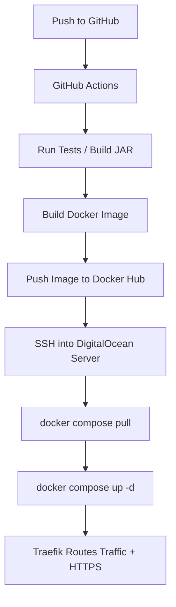

# 🔗 Javalin REST API + Traefik Deployment Pipeline

A lightweight REST API built with **Javalin** and a full production-ready DevOps pipeline using **Docker**, **Traefik**, and **GitHub Actions**.  
Includes routing, controllers, exception handling, middleware-style security, PostgreSQL integration, and automated CI/CD deployment.

---

## 🧿 Status & CI/CD


---

## 📌 Summary

This repository contains:

### **1. A modular, production-ready REST API (main branch)**  
- Javalin routing  
- DAO → Service → Controller  
- Exception & validation handling  
- JWT or custom authentication (depending on your config)  
- Unit + integration tests  
- PostgreSQL integration  

### **2. A complete deployment pipeline (traefik-pipeline branch)**  
- Dockerfile + docker-compose  
- Traefik reverse proxy & TLS certificates  
- GitHub Actions CI/CD  
- DigitalOcean deployment (SSH + Docker Compose)  
- Environment-based configuration  

Branch link:  
🔗 https://github.com/tysker/javalin_rest_api_pipeline/tree/traefik-pipeline

---

## 🧰 Tech Stack

### Backend
- Java + Javalin  
- PostgreSQL  
- JUnit testing  

### DevOps
- Docker & Docker Compose  
- Traefik v3 reverse proxy  
- GitHub Actions CI/CD  
- DigitalOcean droplet (Ubuntu)

---

## 📂 Project Structure

```

src/
├── main/java/
│   ├── controllers/      # HTTP endpoints
│   ├── daos/             # Database layer
│   ├── services/         # Business logic
│   ├── exceptions/       # Custom exceptions
│   ├── security/         # Access manager / filters
│   ├── util/             # Helpers
│   └── App.java          # Application entrypoint
│
└── test/
├── unit/             # Unit tests
└── integration/      # Integration tests

```

---

## 📂 Deployment Pipeline (traefik-pipeline branch)

```

deployment/
├── docker/
│   ├── Dockerfile
│   ├── docker-compose.yml
│   ├── docker-compose.prod.yml
│   └── .env
│
├── traefik/
│   ├── traefik.yml              # Static config
│   ├── traefik_dynamic.yml      # Routers / TLS
│   └── acme.json                # Certificate storage
│
└── github/workflows/
└── deploy.yml               # CI/CD pipeline

````

---

## 🧪 Testing

Run tests:

```bash
mvn test
````

---

## 🚀 Local Development

```bash
mvn clean package
java -jar target/app.jar
```

Runs at:

```
http://localhost:7000
```

---

## 🚀 CI/CD Pipeline Overview



---

## 🛰️ Deployment Architecture

```md
                     ┌──────────────────────────┐
                     │        Traefik v3         │
                     │  Automatic HTTPS / Routing │
                     └──────────────┬────────────┘
                                    │
                   ┌────────────────┴────────────────┐
                   │                                 │
         ┌─────────▼──────────┐          ┌──────────▼─────────┐
         │   Javalin API       │          │   Admin Dashboard   │
         │   (Docker Container)│          │   (Optional)        │
         └─────────┬──────────┘          └──────────┬──────────┘
                   │                                 │
                   └────────────────┬────────────────┘
                                    │
                         ┌──────────▼─────────┐
                         │    PostgreSQL       │
                         │ (Docker Container)  │
                         └─────────────────────┘
```

---

## 📄 Full Documentation

### Api

* All routes
* Example requests
* Example JSON responses
* Error model

---

# API Documentation

Base URL:
```

`/api/*`

````

## User Endpoints

### GET /api/users
Returns list of users.

### GET /api/users/:id
Returns a user by ID.

### POST /api/users
Creates a new user.

Body:
```json
{
  "username": "john",
  "password": "secret"
}
````

### PATCH /api/users/:id

Updates a user.

### DELETE /api/users/:id

Deletes a user.

---

## Error Model

```json
{
  "status": "error",
  "message": "User not found",
  "path": "/api/users/999",
  "timestamp": "2025-01-20T10:15:14Z"
}
```

---

### Pipeline

* Docker architecture
* Traefik configuration
* GitHub Actions workflow explanation
* Deployment steps
* Environment variables

# Deployment Pipeline Documentation

This project includes a complete CI/CD pipeline with:

- Docker
- Docker Compose
- Traefik v3
- GitHub Actions
- DigitalOcean (remote server)

---

## 1. Build Process

GitHub Actions performs:

1. Checkout  
2. Java build (`mvn -B package`)  
3. Run tests  
4. Build Docker image  
5. Push to Docker Hub  

---

## 2. Deployment Process

1. GitHub connects to the remote server via SSH  
2. Server pulls the latest Docker image  
3. Traefik reloads routes automatically  
4. New version goes live instantly  

---

## 3. Traefik Overview

Traefik handles:

- HTTPS certificates via Let’s Encrypt  
- Routing to API container  
- Middleware  
- Logging  
- Security headers  

---

## 4. Environment Variables

`.env` contains:

```
DOMAIN=mydomain.com
EMAIL=[admin@mydomain.com](mailto:admin@mydomain.com)
POSTGRES_URL=jdbc:postgresql://db:5432/app
POSTGRES_USER=user
POSTGRES_PASSWORD=password
APP_PORT=7000
``

## 5. Deployment Trigger

Push to `main` automatically triggers deployment.

---
